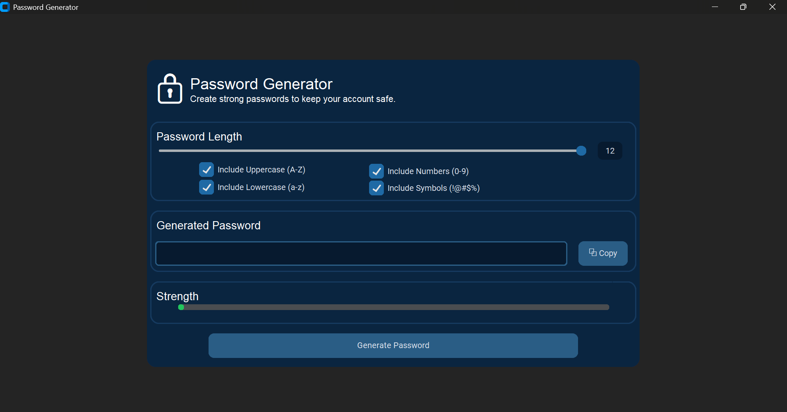

# password_generator

A modern desktop application built with Python and CustomTkinter that generates strong, secure, and customizable passwords. Users can choose the desired password length and select whether to include uppercase letters, lowercase letters, numbers, and special characters.

## Features

- Generate secure passwords
- Choose password length
- Include uppercase and lowercase letters
- Include numbers and special characters
- Copy generated passwords to the clipboard
- User-friendly graphical interface

## Technologies Used

- Python
- CustomTkinter
- Tkinter Messagebox
- Random Module

## Preview

## Author

Goodness Odion
